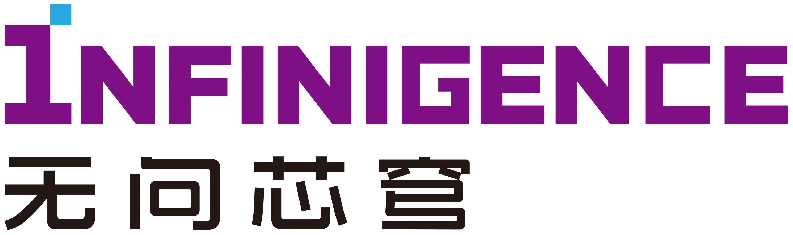

# Evaluating Quantized Large Language Models

## Abstract [[paper](https://arxiv.org/abs/2402.18158)]
Post-training quantization (PTQ) has emerged as a promising technique to reduce the cost of large language models (LLMs). 
Specifically, PTQ can effectively mitigate memory consumption and reduce computational overhead in LLMs. 
To meet the requirements of both high efficiency and performance across diverse scenarios, a comprehensive evaluation of quantized LLMs is essential to guide the selection of quantization methods.
This paper presents a thorough evaluation of these factors by evaluating the effect of PTQ on Weight, Activation, and KV Cache on 11 model families, including OPT, LLaMA2, Falcon, Bloomz, Mistral, ChatGLM, Vicuna, LongChat, StableLM, Gemma, and Mamba, with parameters ranging from 125M to 180B.
The evaluation encompasses five types of tasks: basic NLP, emergent ability, trustworthiness, dialogue, and long-context tasks.
Moreover, we also evaluate the state-of-the-art (SOTA) quantization methods to demonstrate their applicability.
Based on the extensive experiments, we systematically summarize the effect of quantization, provide recommendations to apply quantization techniques, and point out future directions.

## Install qllm_eval

1. Create a new conda environment.
   ```
    conda create -n qllm_eval python=3.9
    conda activate qllm_eval
    ```  

2. Use pip to install packages from requirements.
    ```
    pip install -r requirements.txt
    ```

3. Install FlashAttention2 following the official Github Repo: https://github.com/Dao-AILab/flash-attention.

4. Install the needed files from source.

   ```
   pip install -e .
   ```

## Load and Quantize LLMs

1. Loading LLMs and tokenizers.
    ```python
    from qllm_eval.utils import build_model_and_enc

    model, enc = build_model_and_enc(model_path, use_flash_attn, kv_bit, kv_group_size)
    ```

2. Quantize LLMs, the args contain `w_bit`,` w_group_size`, `a_bit`, `a_group_size`, `kv_bit`, and `kv_group_size`. 
    ```python
    from qllm_eval.quantization.quant_wrapper import quantize_model

    model = quantize_model(model, args)
    ```

3. Apply quantization methods: We store the rep results of AWQ and SmoothQuant for QLLM-Evaluation. You can apply AWQ ot SmoothQuant be Step 2.

    ```python
    from qllm_eval.methods.rep.apply_rep import apply_awq

    rep_results = torch.load(rep_file, map_location="cpu")
    apply_awq(model, rep_results)
    ```

4. You may see the example script `main.py`.

    a. Weight-only Quantization
    ```
    CUDA_VISIBLE_DEVICES=0 python main.py --model_path /Your/LLM/Path --w_bit w_bit --w_group_size w_group_size
    ```

    b. Weight-Activation Quantization
    ```
    CUDA_VISIBLE_DEVICES=0 python main.py --model_path /Your/LLM/Path --w_bit w_bit --w_group_size w_group_size --a_bit a_bit --a_group_size a_group_size
    ```

    c. KV Cache Quantization
    ```
    CUDA_VISIBLE_DEVICES=0 python main.py --model_path /Your/LLM/Path --kv_bit kv_bit --kv_group_size kv_group_size
    ```

    d. Weight-only Quantization

        (1) For AWQ, we need to set the "--w_bit" parameter. For each bit-width, you need to load the corresponding rep result.

        (2) For SmoothQuant, we need to set both the "--w_bit" and "--a_bit" parameters.
    ```
    CUDA_VISIBLE_DEVICES=0 python main.py --model_path /Your/LLM/Path --rep_file /Your/Rep/Result.pt
    ```

## Run Evaluation Benchmarks

1. `Basic NLP Tasks`: We use OpenCompass to evaluate Basic NLP Tasks, you may follow the document [here](qllm_eval/evaluation/q_opencompass/README.md).

2. `Emergent Abilities`: We use OpenCompass to evaluate Emergent Abilities, you may follow the document [here](qllm_eval/evaluation/q_opencompass/README.md).

3. `Trustworthiness Tasks`: We use three different tools to evaluate the Trustworthiness.

    a. For ETHICS benchmark, we write a workflow ourself for evaluation. You may follow the document [here](qllm_eval/evaluation/q_ethic/README.md).

    b. For TruthfulQA benchmark, we use the [lm-evaluation-harness](https://github.com/EleutherAI/lm-evaluation-harness) for evaluation, you may follow the document [here](qllm_eval/evaluation/q_harness/README.md).

    c. For AdvGLUE benchmark, we use OpenCompass for evaluation, you may follow the document [here](qllm_eval/evaluation/q_opencompass/README.md).

4. `Dialogue Tasks`: We use [MT-Bench]() for evaluation, you may follow the document [here](qllm_eval/evaluation/q_dialogue/README.md).

5. `Long-Context Tasks`: We evaluate LLMs on [LongEval](https://github.com/DachengLi1/LongChat) and [Lost-in-the-middle](https://github.com/nelson-liu/lost-in-the-middle) benchmarks, you may follow the document [here](qllm_eval/evaluation/q_long/README.md).


## Citation
```
@misc{li2024evaluating,
      title={Evaluating Quantized Large Language Models}, 
      author={Shiyao Li and Xuefei Ning and Luning Wang and Tengxuan Liu and Xiangsheng Shi and Shengen Yan and Guohao Dai and Huazhong Yang and Yu Wang},
      year={2024},
      eprint={2402.18158},
      archivePrefix={arXiv},
      primaryClass={cs.CL}
}
```

This work is maintained by [NICS-EFC Lab](https://nicsefc.ee.tsinghua.edu.cn/) (Tsinghua University) and [Infinigence-AI](https://www.infini-ai.com/) (Beijing China).

<p align="middle">
  
  
</p>

## Contact Us

* Shiyao Li: lishiyao20@mails.tsinghua.edu.cn
* Xuefei Ning: foxdoraame@gmail.com
* Yu Wang: yu-wang@tsinghua.edu.cn 